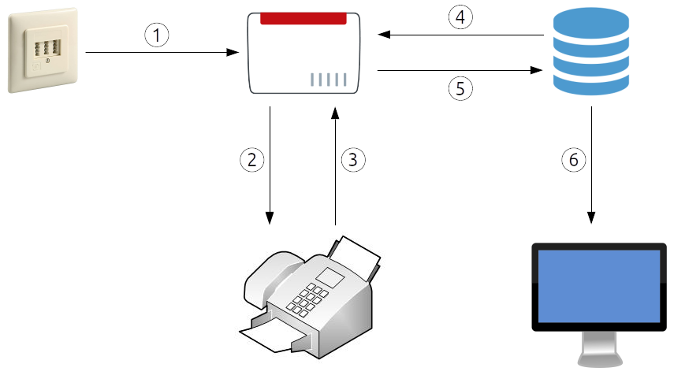

# JarFIS


[](https://github.com/stefan-niedermann/fis/actions)
[](https://github.com/stefan-niedermann/nextcloud-fis/issues)
[](https://github.com/stefan-niedermann/nextcloud-fis/stargazers)
[](https://github.com/stefan-niedermann/fis/tags)
[](https://www.gnu.org/licenses/agpl-3.0)

**J**ava **ar**chive **F**irefighter **I**nformation **S**ystem

- [What is this?](#what-is-this)
- [How does it work?](#how-does-it-work)
- [How to use?](#how-to-use)
  - [Prerequisites](#prerequisites)
  - [Configuration](#configuration)
  - [Start](#start)
  - [Run as service](#run-as-service)
- [Maintainer](#maintainer)
- [License](#license)

## What is this?

`JarFIS` covers a special use case for german firefighters, who usually are notified about new operations via fax. The
tool is capable of displaying the same information on an info screen to better spread the incoming information to new
volunteer firefighters who arrive at the fire department.

While nothing happens, it will display the current weather situation. When a new operation arrives, it will switch the
screen for some time to an operation screen and return to the default info screen after a configurable duration.

## How does it work?

The environment can vary of course, but the idea is that a fax arrives at the primary number (1) and gets routed to the
fax printing device (2). The fax printing device should print the information and then forward the fax to a secondary
number (3) which will be stored by the router on an internal memory / FTP server as a PDF file.

`JarFIS` will poll this FTP storage (4) and download a new incoming PDF file (5). Then it extracts the text using
optical character recognition, parse the text to a machine-readable JSON file and display it on the info screen (6).



## How to use?

### Prerequisites

- You will need at least a [Java Runtime Environment 17 or higher](https://java.com)
- Get a free API key for [OpenWeatherMap](https://openweathermap.org/)
- Install [`Tesseract ≥ 4.0.0`](https://tesseract-ocr.github.io/tessdoc/Installation.html), on Debian / Ubuntu based systems, this is usually done with
  ```sh
  sudo apt install tesseract-ocr
  ```

### Configuration

Create a file called `application.yml` next to the `.jar` file which you downloaded. Comment lines (starting with a `#`)
are optional. Remove the leading `#` to activate and change them. Unit for all time related options is `millisecond`.

```yml 
fis:
  ftp:
    username: SECRET
    password: SECRET
    # host: fritz.box
    # path: /FRITZ/faxbox
    # fileSuffix: .pdf
    # pollInterval: 10000
  weather:
    key: SECRET # OpenWeatherMap API key
    # lang: de
    # units: metric
    # location: 2921044
    # pollInterval: 60000
  # tesseract:
    # lang: deu
    # tessdata: 
  # operation:
    # duration: 1800000
  # client:
    # weatherPollInterval: 30000
    # operationPollInterval: 2000
    # highlight: 
```

For more information about advanced configuration (e.g. passing arguments from the command line, …) see
the [Spring Boot documentation](https://docs.spring.io/spring-boot/docs/current/reference/html/spring-boot-features.html#boot-features-external-config).

### Start

```sh
java -jar fis.jar
```

Then start a web browser at [`http://localhost:8080`](http://localhost:8080).

### Run as service

To run JarFIS as a `systemd` service, put the below file as `fis.service` into `/etc/systemd/system`, replace `User` with the user that should run the service and `ExecStart` with the path to your `jar` file:

```systemd
[Unit]
Description=JarFIS
After=syslog.target
Wants=network-online.target
After=network.target network-online.target

[Service]
User=sampleuser
ExecStart=/opt/jarfis/fis.jar
SuccessExitStatus=143 

[Install] 
WantedBy=multi-user.target
```

Mark the `.jar` file as `executable`:

```sh
chmod +x fis.jar
```

Call `sudo systemctl daemon-reload` to make `systemd` aware of the new service and `systemctl enable fis.service` to run JarFIS automatically when booting your server.

See the Spring Boot documentation to learn how to configure JarFIS as [`init.d`](https://docs.spring.io/spring-boot/docs/current/reference/html/deployment.html#deployment.installing.nix-services.init-d) service or on [`Windows`](https://docs.spring.io/spring-boot/docs/current/reference/html/deployment.html#deployment.installing.windows-services). 

It is highly recommended providing a proper logging strategy in your `application.yml` by appending:

```yml
logging:
  pattern:
    console:
  file:
    name: fis.log
  logback:
    rollingpolicy:
      file-name-pattern: logs/fis-%d{yyyy-MM-dd}.%i.log
      max-history: 30
```

## Maintainer

[](https://www.niedermann.it)

## License

All contributions to this repository are considered to be licensed under
the [`GNU Affero General Public License 3+`](https://www.gnu.org/licenses/agpl-3.0).

Contributors to `JarFIS` retain their copyright. Therefore we recommend to add following line to the header of a file,
if you changed it substantially:

```
@copyright Copyright (c) <year>, <your name> (<your email address>)
```
